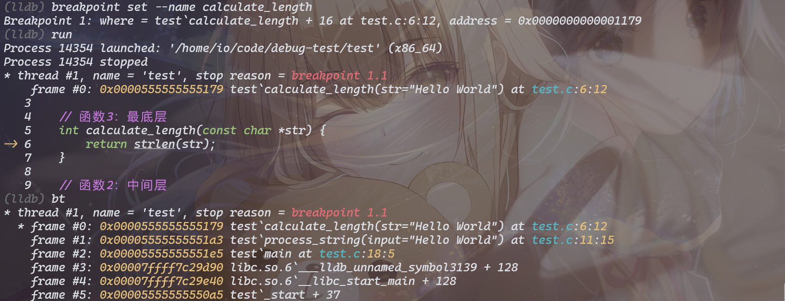

持续更新...

## visual studio 进行 dump 文件的调式和分析

进行 dump 文件分析，需要以下文件：

*  进程crash的dump文件
* 程序的符号表和exe
* 准备好能用的visual studio


本地测试

**右键 任务管理器的exe 运行时程序，然后 创建内存转储文件** 即可生成 dump 文件

点击 dump 文件， 默认是用visual studio打开的，出现界面如下


使用 混合进行 调试


若出现类似问题


新建路径，添加 二进制文件（.exe）和pdb 符号所在路径，最后点击加载即可

之后便是 进行 visual studio的堆栈和变量分析


## lldb 堆栈调试


```bash
touch test.c
vim test.c
```

进入 `insert` 模式，写入

```c
#include <stdio.h>
#include <string.h>

// 函数3：最底层
int calculate_length(const char *str) {
    return strlen(str);
}

// 函数2：中间层
void process_string(const char *input) {
    int len = calculate_length(input);
    printf("Length: %d\n", len);
}

// 函数1：入口层
int main() {
    const char *text = "Hello World";
    process_string(text);
    return 0;
}
```

使用gcc编译程序，带调试信息

```bash
gcc -g -O0 test.c -o test
```

启动 LLDB 调试器

```bash
lldb test
```


打断点，运行，查看调用堆栈




常见命令如下


*  `bt`: 查看调用堆栈(`bt`)
*  `bt all`: 所有线程堆栈(`bt all`)
* `frame select N`: 切换到第 N 帧(`frame select 1`)
* `frame variable`: 查看当前帧变量(`frame variable`)
* `p 变量`: 打印变量值(`p str`)
* `up` / `down`: 上/下切换帧(`up`)
* `thread list`: 查看所有线程(`thread list`)

上述方法可以 

* 查找崩溃位置， bt 之后 frame select n（到对应函数） ，frame variable；查看哪个参数为 NULL
* 查看递归调用， bt之后 frame select n（到对应的递归函数），p n ; 打印出变量
* 支持多线程调试，thread list，之后 bt all（查看所有线程的调用堆栈）


