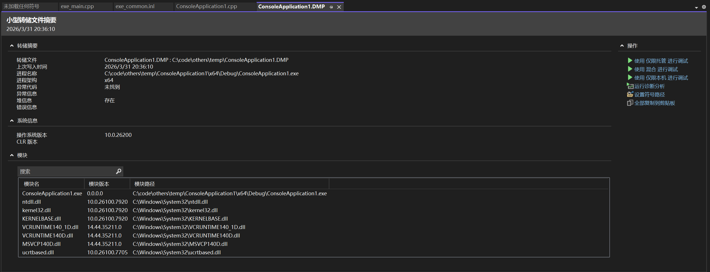
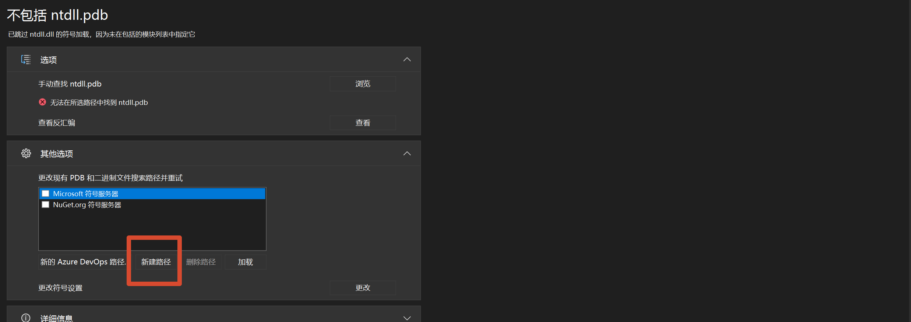

持续更新...

## visual studio 进行 dump 文件的调式和分析

进行 dump 文件分析，需要以下文件：

*  进程crash的dump文件
* 程序的符号表和exe
* 准备好能用的visual studio

本地测试

**右键 任务管理器的exe 运行时程序，然后 创建内存转储文件** 即可生成 dump 文件

点击 dump 文件， 默认是用visual studio打开的，出现界面如下

使用 混合进行 调试

若出现类似问题

新建路径，添加 二进制文件（.exe）和pdb 符号所在路径，最后点击加载即可

之后便是 进行 visual studio的堆栈和变量分析

